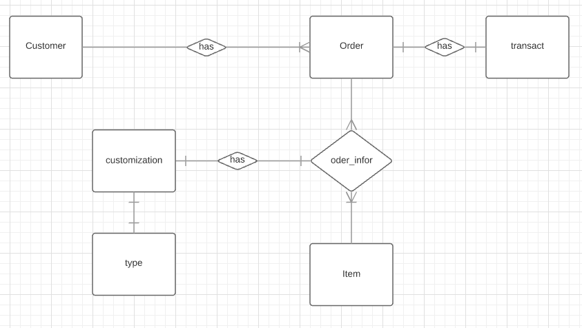

# e-Clothing-store-database-

# Business rule & Assumption
Assumption
•	For `item` table, the store going to increase the type of their product and will not only selling shirt anymore. So I made a column name so that can add items such as: pants, t-shirt, polo.
•	For `type` table, I assumed that the the store  will have only 3 fixed size for image, logo and text so that it will appear the best on the shirt and also the customer  will be easy to choose how large or small the customization (image,logo, text) can be. 
o	I created Small, Medium, Large logo, image, text
•	For size in `type` table, the value is understand as cm2 
•	However, for `type` table, the store can also add more type of customizationt that they can provide for the customer. The store can still scale up and there is no limitation.
•	For `transact` table. Based on the requirement, I assumed that all the transaction information wil be record into one table because there only a few information needed to be stored as well as all of them need a received tick. 
•	I assumed that there will be a total price for the `order` table.
•	For `customization` table, there will only a column data to store anything that the customer submit to print on their shirt. 
•	In `transact`, information such as purchase date, type of payment and payment type information will be stored.
•	I could have put the id for item table in VARCHAR to better specified the product. However, I think it is better to do it as auto increment int because it is better for business scale up when they will input so many more products.

Business rule 
•	For null and not null, field that have to be inputed (not null) are:
o	Primary key
o	 Moreover, only the talbe `type`  is all not null because those information is needed to be clear for the customer. 
o	Customer also have to input the data in the `customization`table. 
•	Yes and No, as well as (money receive) tick fields in the database are handled with VARCHAR(1) for Y(yes) and N(no) or R(received) or N(not) 
•	
•	For the scenario when customer choose the buying shirt. They will choose, the shirt which fit requirement such as: type, sleeves, style, size, color, and price. When they choose customization, they will submit what they want to print on the shirt AND specific type of customization that the shop offer. (type information located in type talbe) 
•	Quantity can only be specified in `order` talbe 
o	So, if they want to order many different shirt/, different customization. They will need to make many order to fit with their needs.
	To be more clear, one order can only consist one type of shirt with one customization and the amount of it. 
•	If the customer cancel order, based on the customer id, they shop can delete all the information, ‘Y’ can be added and the meaning will be order cancelled in the database. 
o	These information can be used to calculate the order that was cancelled ( to track scam, bad intention people or just known about the number of total order made and percentage of not canceled and cancelled order)

# ERD 

